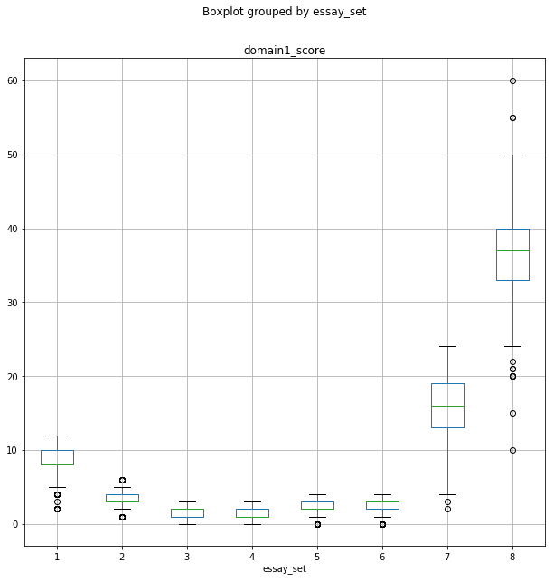
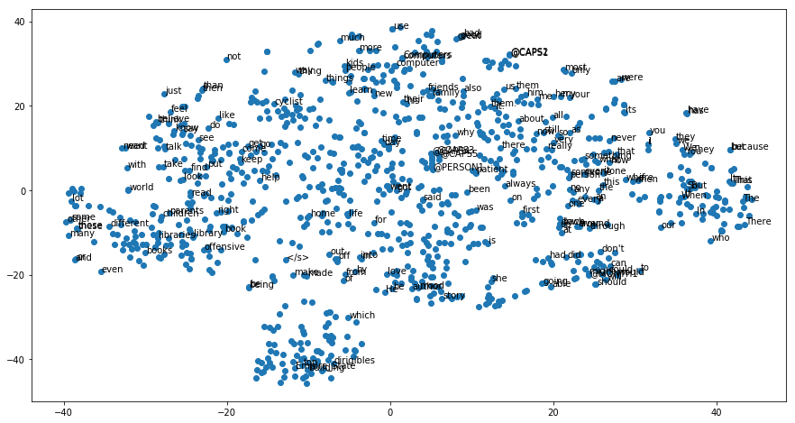

# automated-essay-scoring
### 概要
本项目通过文本分析技术实现对一篇作文的自动打分，目标是作文得分，采用gbdt模型进行拟合。
类似于其他的nlp技术，回归问题的核心在于特征工程。本项目使用词向量表示文章特征，加上文章单词数，各类词性的单词数，错别字，句子个数等等，将上述特征串联作为输入，使用gbdt模型拟合目标   
### 依赖
 - python3
 - pandas
 - numpy
 - matplotlib
 - nltk
 - sklearn
 - word2vec
 - string

### 实现
#### 1.数据分析
使用boxplot可视化作文分数的分布，如下图：

可以看到在作文类型为1,2,5,6,7,8中有个别的异常值点，这些异常值点需要在文本预处理时剔除。

#### 2.训练词向量
利用word2vec对训练样本做词向量的训练，可视化结果如下：

可以看到意思相近的词的距离还是比较近的，比如，总是在开头的when和who，kid和people等等。

#### 3.特征工程
 - 文本特征采用采样的方式，目标是从文章中一共采样200个词向量，均匀间隔采样，不够则从头开始循环采样
 - 文章中单词的平均长度
 - 文章中单词的总数
 - 文章中句子的个数
 - 文章中的错别字个数
 - 文章中的各类词性的个数，本项目包括名词，动词和形容词

#### 4.训练
模型采用gbdt，超参数的调优采用贝叶斯优化，调优超参数包括回归树数量，回归树深度，学习率，每个叶节点包含的最少样本数。最终的最优参数为100颗回归树，回归树深度为10，最少包含节点数为4，学习率为0.1。

### 结果
在测试集上的均方误差为15.9293，即平均每篇文章的平均误差在4分左右。

### 总结
本项目通过文章做特征工程，加上gdbt拟合，实现一个自动预测作文得分的系统。
